<!-- ═══════════════════════ 1 · MATRIX HEADER (custom SVG) ═══════════════════════ -->
<!-- PLACEHOLDER: replace ./matrix-header.svg with the final custom animated header -->
<div align="center">


</div>

<!-- ═══════════════════════ 2 · TAGLINE + SOCIALS ═══════════════════════ -->
<div align="center">

[;Building+intelligent+systems+end+to+end;Machine+Learning+-+Computer+Vision+-+GenAI;Decrypting+complex+problems+into+clean+code)](https://git.io/typing-svg)

<a href="https://www.linkedin.com/in/sulaiman-khalid-43963b32a/"></a>
<a href="mailto:s4436182@gmail.com"></a>


</div>

<!-- ═══════════════════════ 3 · ABOUT ME (terminal) ═══════════════════════ -->
<!-- ═══════════════════════ 3 · ABOUT ME (custom animated SVG — placeholder) ═══════════════════════ -->
<!-- PLACEHOLDER: replace ./about-terminal.svg with the animated terminal SVG we'll build next -->
<div align="center">

## 🧠 About Me



</div>

<!-- ═══════════════════════ 4 · TECH STACK (compact 4-column) ═══════════════════════ -->
<div align="center">

## 🛠️ Tech Stack

<table>
<tr>
<td align="center"><b>Languages</b></td>
<td align="center"><b>AI / ML</b></td>
<td align="center"><b>Web &amp; Data</b></td>
<td align="center"><b>Tools</b></td>
</tr>
<tr>
<td align="center"><a href="https://www.python.org/" target="_blank"></a> <a href="https://cplusplus.com/" target="_blank"></a><br/><a href="https://learn.microsoft.com/en-us/dotnet/csharp/" target="_blank"></a> <a href="https://developer.mozilla.org/en-US/docs/Web/JavaScript" target="_blank"></a><br/><a href="https://www.typescriptlang.org/" target="_blank"></a> <a href="https://www.java.com/" target="_blank"></a></td>
<td align="center"><a href="https://pytorch.org/" target="_blank"></a> <a href="https://www.tensorflow.org/" target="_blank"></a><br/><a href="https://scikit-learn.org/" target="_blank"></a> <a href="https://opencv.org/" target="_blank"></a></td>
<td align="center"><a href="https://react.dev/" target="_blank"></a> <a href="https://nodejs.org/" target="_blank"></a><br/><a href="https://tailwindcss.com/" target="_blank"></a> <a href="https://supabase.com/" target="_blank"></a><br/><a href="https://www.mysql.com/" target="_blank"></a> <a href="https://developer.mozilla.org/en-US/docs/Web/HTML" target="_blank"></a><br/><a href="https://developer.mozilla.org/en-US/docs/Web/CSS" target="_blank"></a></td>
<td align="center"><a href="https://git-scm.com/" target="_blank"></a> <a href="https://github.com/" target="_blank"></a><br/><a href="https://code.visualstudio.com/" target="_blank"></a> <a href="https://www.figma.com/" target="_blank"></a><br/><a href="https://ubuntu.com/" target="_blank"></a></td>
</tr>
</table>

</div>

<!-- ═══════════════════════ 5 · GITHUB STATS (streak only) ═══════════════════════ -->
<div align="center">

## 📊 GitHub Stats


</div>

<!-- ═══════════════════════ 6 · CONTRIBUTION MATRIX (snake) ═══════════════════════ -->
<!-- PLACEHOLDER: snake-matrix.svg is generated by the GitHub Action (Platane/snk) -->
<div align="center">

## 🐍 Contribution Matrix


</div>

<!-- ═══════════════════════ 7 · FOOTER ═══════════════════════ -->
<div align="center">

```bash
sulaiman@ai-engineer:~$ echo "Let's build something intelligent."
```

</div>
